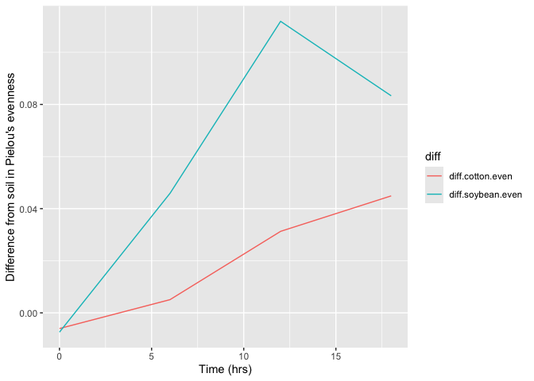

Loading library

``` r
library(tidyverse)
```

    ## ── Attaching core tidyverse packages ──────────────────────── tidyverse 2.0.0 ──
    ## ✔ dplyr     1.1.4     ✔ readr     2.1.5
    ## ✔ forcats   1.0.0     ✔ stringr   1.5.1
    ## ✔ ggplot2   3.5.1     ✔ tibble    3.2.1
    ## ✔ lubridate 1.9.3     ✔ tidyr     1.3.1
    ## ✔ purrr     1.0.2     
    ## ── Conflicts ────────────────────────────────────────── tidyverse_conflicts() ──
    ## ✖ dplyr::filter() masks stats::filter()
    ## ✖ dplyr::lag()    masks stats::lag()
    ## ℹ Use the conflicted package (<http://conflicted.r-lib.org/>) to force all conflicts to become errors

Download two .csv files from Canvas called DiversityData.csv and
Metadata.csv and read them into R using relative file paths.

``` r
Diversity_Data <- read.csv("~/Documents/GitHub/Data_Wrangling_Challenge/DiversityData.csv")
Meta_Data <- read.csv("~/Documents/GitHub/Data_Wrangling_Challenge/Metadata.csv")
```

Join the two dataframes together by the common column ‘Code’. Name the
resulting dataframe alpha.

``` r
alpha <- full_join(Diversity_Data, Meta_Data, by = "Code")
```

Calculate Pielou’s evenness index: Pielou’s evenness is an ecological
parameter calculated by the Shannon diversity index (column Shannon)
divided by the log of the richness column. a. Using mutate, create a new
column to calculate Pielou’s evenness index. b. Name the resulting
dataframe alpha_even.

``` r
alpha_even <- mutate(alpha, Pielou = shannon/log(richness))
```

Using tidyverse language of functions and the pipe, use the summarise
function and tell me the mean and standard error evenness grouped by
crop over time. a. Start with the alpha_even dataframe b. Group the
data: group the data by Crop and Time_Point. c. Summarize the data:
Calculate the mean, count, standard deviation, and standard error for
the even variable within each group. d. Name the resulting dataframe
alpha_average

``` r
alpha_average <- alpha_even %>%
  group_by(Crop, Time_Point) %>%
  summarise(mean.even = mean(Pielou),
            n = n(),
            sd.dev = sd(Pielou)) %>%
  mutate(std.err = sd.dev/sqrt(n))
```

    ## `summarise()` has grouped output by 'Crop'. You can override using the
    ## `.groups` argument.

Calculate the difference between the soybean column, the soil column,
and the difference between the cotton column and the soil column a.
Start with the alpha_average dataframe b. Select relevant columns:
select the columns Time_Point, Crop, and mean.even. c. Reshape the data:
Use the pivot_wider function to transform the data from long to wide
format, creating new columns for each Crop with values from mean.even.
d. Calculate differences: Create new columns named diff.cotton.even and
diff.soybean.even by calculating the difference between Soil and Cotton,
and Soil and Soybean, respectively. e. Name the resulting dataframe
alpha_average2

``` r
alpha_average2 <- alpha_average %>%
  select(Time_Point, Crop, mean.even) %>%
  pivot_wider(names_from = Crop, values_from = mean.even) %>%
  mutate(diff.cotton.even = Soil - Cotton) %>%
  mutate(diff.soybean.even = Soil - Soybean)
```

Connecting it to plots a. Start with the alpha_average2 dataframe b.
Select relevant columns: select the columns Time_Point,
diff.cotton.even, and diff.soybean.even. c. Reshape the data: Use the
pivot_longer function to transform the data from wide to long format,
creating a new column named diff that contains the values from
diff.cotton.even and diff.soybean.even. i. This might be challenging, so
I’ll give you a break. The code is below.
pivot_longer(c(diff.cotton.even, diff.soybean.even), names_to = “diff”)
d. Create the plot: Use ggplot and geom_line() with ‘Time_Point’ on the
x-axis, the column ‘values’ on the y-axis, and different colors for each
‘diff’ category. The column named ‘values’ come from the pivot_longer.
The resulting plot should look like the one to the right.

``` r
alpha_average2 %>%
    select(Time_Point, diff.cotton.even, diff.soybean.even) %>%
  pivot_longer(c(diff.cotton.even, diff.soybean.even), names_to = "diff") %>%
  ggplot(aes(x = Time_Point, y = value, color = diff)) +
         geom_line() +
         xlab("Time (hrs)") +
         ylab("Difference from soil in Pielou's evenness")
```

<!-- -->

Commit and push a gfm .md file to GitHub inside a directory called
Coding Challenge 5. Provide me a link to your github written as a
clickable link in your .pdf or .docx

[Github](https://github.com/RaimundoEspejo/Data_Wrangling_Challenge.git)
